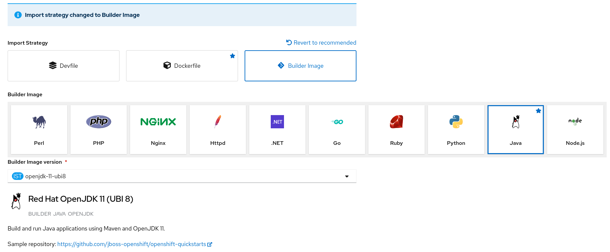
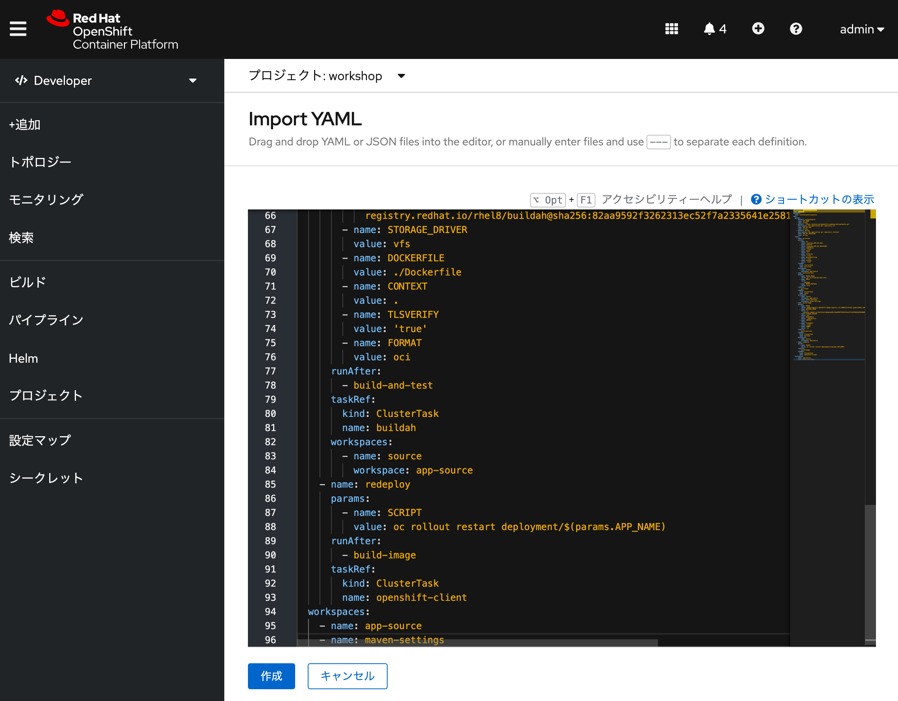
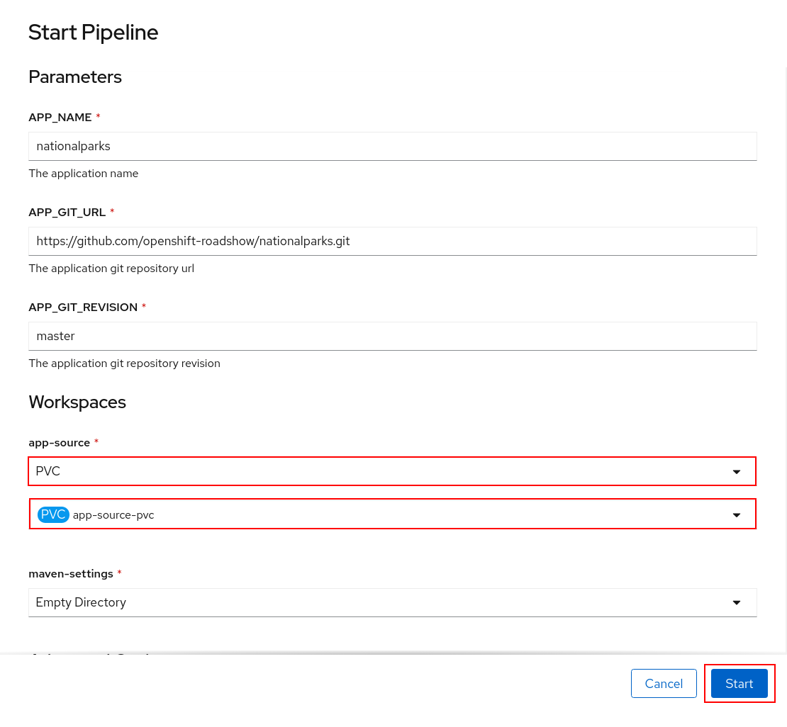
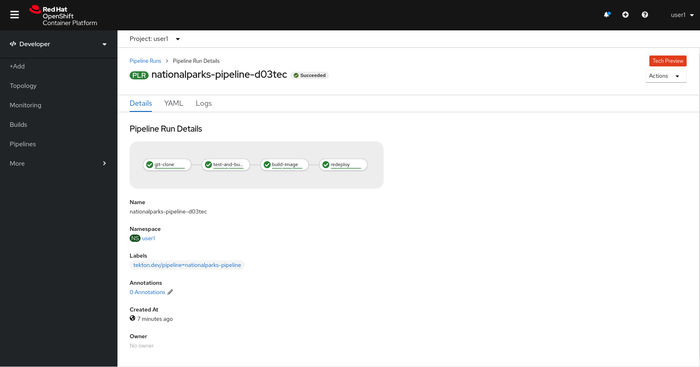

:labname: パイプラインとの連携
:OC_CLI_VERSION: 4.4
:OC_CLI_URL: https://mirror.openshift.com/pub/openshift-v4/clients/oc/{OC_CLI_VERSION}

== {labname} 

.シナリオ

このラボでは、パイプラインと、アプリケーションのライフサイクルを処理するようにOpenShiftでパイプラインを設定する方法について学習します。

* OpenShift Pipelinesは、 Tektonを使用してパイプラインを構築するためのクラウドネイティブの継続的インテグレーションおよびデリバリー（CI / CD）ソリューションです。
* Tektonは、柔軟なKubernetesネイティブのオープンソースCI / CDフレームワークであり、基盤となる詳細を抽象化することで、複数のプラットフォーム（Kubernetes、サーバーレス、VMなど）へのデプロイを自動化できます。
* 継続的デリバリー（CD）パイプラインは、ソフトウェアをバージョン管理からユーザーや顧客に直接届けるためのプロセスを自動化したものです。ソフトウェアへのすべての変更（ソース管理でコミット）は、リリースされるまでに複雑なプロセスを経ます。このプロセスには、信頼性が高く反復可能な方法でソフトウェアをビルドすることと、ビルドされたソフトウェアをテストと展開の複数の段階で進行させること（「ビルド」と呼ばれる）が含まれます。

[[labexercises]]

== Javaアプリケーションの作成
このラボには独自のgitリポジトリがあるので、単純なJavaS2Iイメージで使用してみましょう。

. プロジェクトの作成
* *Name* を `workshop` として、プロジェクトを作成します。

. アプリケーションのビルド
* 開発者パースペクティブで、左側のナビゲーションで[ +追加]をクリックし、[ Gitリポジトリ]セクションに移動して、[ Gitから]オプションを選択します。
+
image:images/04_90_nationalparks-show-add-options.png[]
+
* Import from Gitワークフローは、いくつかの選択に基づいてアプリをデプロイするプロセスをガイドします。GitリポジトリのURLに次のように入力します。
+
[source,plain]
----
https://github.com/openshift-roadshow/nationalparks.git
----
NOTE: OpenShiftは、ソースコードで使用されているGitサーバータイプとプログラミング言語を自動的に推測します。インポート戦略を選択するように求められます。
+
* [インポート戦略の編集]をクリックします。
+
image:images/04_91_nationalparks-import-strategy.png[]
+
NOTE: 3つのオプションがあります。
+
** Devfile：これはDevfilev2仕様を使用してアプリケーションスタックを作成します。devfile.yamlリポジトリには、Devfilev2形式で名前が付けられたファイルが含まれている必要があります。
** Dockerfile：これにより、既存のDockerfileからコンテナイメージが作成されます。
** ビルダーイメージ：これは、Source-to-Imageと呼ばれるメカニズムを使用して、ソースコードから直接コンテナーイメージを自動的に作成します。
+
* 次のセクションで説明するように、ソースコードからコンテナイメージを作成するため、 [ビルドイメージ]を選択します。
+

+
NOTE: Dockerfileを使用することもできます。リポジトリには、マルチステージのDockerfileが含まれています。この演習では、イメージのビルド機能を示します。
+
* ビルダーイメージとしてJavaが選択されていることを確認し、OpenJDK11を使用するにはバージョン *openjdk-11-ubi8* を選択してください。
+
* [全般]セクションまで下にスクロールします。以下を追加します。
+
アプリケーション名：
+
[source,plain]
----
workshop
----
+
名前：
+
[source,plain]
----
nationalparks
----
+
* [作成]をクリックして送信します。
+
image:images/04_93_nationalparks-configure-service1.png[]
+
* ビルドログを表示するには、トポロジビューでnationalparksエントリをクリックし、[リソース]タブの[ビルド]セクションで[ログの表示]をクリックします。
+
image:images/04_94_nationalparks-java-new-java-build.png[]
+
これは、ビルドおよび依存関係システムとしてMavenを使用するJavaベースのアプリケーションです。このため、Mavenがアプリケーションに必要なすべての依存関係をダウンロードするため、初期ビルドには数分かかります。あなたはこれらすべてがリアルタイムで起こっているのを見ることができます！
+
. リソースの確認
* CLIから作成されたリソースも確認することができます。
+
[source,plain]
----
oc get builds
oc logs -f builds/nationalparks-1
oc get routes
----
+
NOTE: これはバックエンドアプリケーションであるため、実際にはWebインターフェイスはありません。ただし、ブラウザでは引き続き使用できます。parksmapフロントエンドと連携するすべてのバックエンドは、/ws/info/エンドポイントを実装する必要があります。テストするには、ブラウザで次のURLにアクセスしてください。
+
image:images/04_94_nationalparks-java-new-java-build.png[]

== パイプラインで使うストレージを作成する
OpenShiftは、永続ボリュームクレームリクエストを介してアプリケーションを実行しているポッドに接続される永続ボリュームを使用してストレージを管理します。また、Webコンソールから簡単に管理する機能も提供します。

* 管理者の観点から、 [ストレージ] → [永続ボリュームクレーム]に移動します。
* 右上に移動し、[永続ボリュームクレームの作成]ボタンをクリックします。
* 永続ボリュームクレーム名の中にapp-source-pvcを挿入します。
* RWOシングルユーザーアクセスモードを使用してパイプライン用に1GiB永続ボリュームを作成するため、[サイズ]セクションに1を挿入します。
* 他のすべてのデフォルト設定をそのままにして、[作成]をクリックします。
+
image:images/04_101_nationalparks-codechanges-pipeline-pvc.png[]

== Tektonパイプラインを作成する
パイプラインは配信サイクルのさまざまな段階間でアプリケーションをプロモートする機能を提供するため、パイプラインを実行する継続的インテグレーションサーバーであるTektonは、継続的インテグレーションの役割を持つプロジェクトにデプロイされます。このプロジェクトで実行されるパイプラインには、配信サイクルのさまざまな段階をモデル化するすべてのプロジェクトと対話するための権限があります。

この例では、コードがあるのと同じGitHubリポジトリに格納されているパイプラインをデプロイします。より現実的なシナリオでは、インフラストラクチャーをコード原則として尊重するために、使用するすべてのOpenShiftリソース定義とともにすべてのパイプライン定義を保存します。

* 次に、Nationalparksバックエンド用のTektonパイプラインを作成し、以下の表からOpenShiftクラスタータイプを選択します。
+
image:images/04_100_add-tekton-pipelines.png[]
+

+
[source, yaml]
----
apiVersion: tekton.dev/v1beta1
kind: Pipeline
metadata:
  name: nationalparks-pipeline
spec:
  params:
    - default: nationalparks
      name: APP_NAME
      type: string
    - default: 'https://github.com/openshift-roadshow/nationalparks.git'
      description: The application git repository url
      name: APP_GIT_URL
      type: string
    - default: master
      description: The application git repository revision
      name: APP_GIT_REVISION
      type: string
  tasks:
    - name: git-clone
      params:
        - name: url
          value: $(params.APP_GIT_URL)
        - name: revision
          value: $(params.APP_GIT_REVISION)
        - name: submodules
          value: 'true'
        - name: depth
          value: '1'
        - name: sslVerify
          value: 'true'
        - name: deleteExisting
          value: 'true'
        - name: verbose
          value: 'true'
      taskRef:
        kind: ClusterTask
        name: git-clone
      workspaces:
        - name: output
          workspace: app-source
    - name: build-and-test
      params:
        - name: MAVEN_IMAGE
          value: gcr.io/cloud-builders/mvn
        - name: GOALS
          value:
            - package
        - name: PROXY_PROTOCOL
          value: http
      runAfter:
        - git-clone
      taskRef:
        kind: ClusterTask
        name: maven
      workspaces:
        - name: source
          workspace: app-source
        - name: maven-settings
          workspace: maven-settings
    - name: build-image
      params:
        - name: IMAGE
          value: image-registry.openshift-image-registry.svc:5000/$(context.pipelineRun.namespace)/$(params.APP_NAME):latest
        - name: BUILDER_IMAGE
          value: >-
            registry.redhat.io/rhel8/buildah@sha256:82aa9592f3262313ec52f7a2335641e2581b0d0d9807980846d0539bb77d0657
        - name: STORAGE_DRIVER
          value: vfs
        - name: DOCKERFILE
          value: ./Dockerfile
        - name: CONTEXT
          value: .
        - name: TLSVERIFY
          value: 'true'
        - name: FORMAT
          value: oci
      runAfter:
        - build-and-test
      taskRef:
        kind: ClusterTask
        name: buildah
      workspaces:
        - name: source
          workspace: app-source
    - name: redeploy
      params:
        - name: SCRIPT
          value: oc rollout restart deployment/$(params.APP_NAME)
      runAfter:
        - build-image
      taskRef:
        kind: ClusterTask
        name: openshift-client
  workspaces:
    - name: app-source
    - name: maven-settings
----

+
* 作成したパイプラインを確認します。

+
** Pipelineは、CDパイプラインのユーザー定義モデルです。パイプラインのコードは、ビルドプロセス全体を定義します。これには通常、アプリケーションをビルドし、テストしてから配信するためのステージが含まれます。
** TaskとClusterTaskには、実行するステップが含まれています。ClusterTasksは、OpenShift Pipelinesがインストールされているクラスター内のすべてのユーザーが利用できますが、Tasksはカスタムにすることができます。
+
* このパイプラインには、次の4つのタスクが定義されています。

** git clone：これは、ClusterTask国立公園のソースリポジトリのクローンをWorkspace app-source作成し、作成されたPVCを使用するに保存します。app-source-workspace

** build-and-test：を使用してJavaアプリケーションをビルドおよびテストしますmaven ClusterTask

** build-image：これはbuildah ClusterTaskであり、OpenShiftの入力としてバイナリファイル（この場合は前のタスクで生成されたJARアーティファクト）を使用してイメージをビルドします。

** redeploy： ClusterTaskを使用して、前のラボで作成したopenshift-client名前のデプロイメントを使用して、OpenShiftに作成されたイメージをデプロイします。nationalparks

+
* 左側のメニューから[パイプライン]をクリックし、次に[ nationalparks-pipeline ]をクリックして、作成したパイプラインを表示します。
+
image:images/04_100_devops-pipeline-created.png[]

+
* パイプラインはパラメトリックであり、使用する必要のあるものにデフォルト値があります。2つのワークスペースを使用しています：
** app-source ：以前に作成されたPersistentVolumeClaim にリンクされています。これは、別のタスクapp-source-pvcで使用されるアーティファクトを保存するために使用されます
** maven-settings： Mavenキャッシュ用のEmptyDirボリューム。これをPVCで拡張して、後続のMavenビルドを高速化することもできます。

== パイプラインを実行する
これで、Webコンソールからパイプラインを開始できます。
* Developer Perspective内で、左側のメニューに移動し、[ Pipeline ]をクリックしてから、 nationalparks-pipelineをクリックします。
*右上の[アクション]リストから、[開始]をクリックします。
+
image:images/04_102_devops-pipeline-start-1.png[]
パイプラインを追加するためのパラメータが表示され、デフォルトのものが表示されます。

APP_GIT_URLでnationalparks、 GitHubからリポジトリを確認します。

[source,plain]
----
https://github.com/openshift-roadshow/nationalparks.git
----
* ワークスペース→ app-sourceで、リストからPVCを選択し、次にapp-source-pvcを選択します。これは、ソースコードとコンパイルされたアーティファクトを含むパイプラインのパイプラインタスクによって使用される共有ボリュームです。
+
* [開始]をクリックして、パイプラインを実行します。
+

+
* Webコンソールからパイプラインの実行を簡単に追跡できます。
** Developer Perspectiveを開き、左側のメニューに移動し、[ Pipeline ]をクリックしてから、 nationalparks-pipelineをクリックします。
* [パイプラインの実行]タブに切り替えて、進行中のすべてのステップを監視します。
+
image:images/04_104_devops-pipeline-run-1.png[]
+
* PipelineRun National-parks-deploy-run-をクリックします。
+
image:images/04_105_devops-pipeline-run-java-2.png[]
+
* 次に、実行中のタスクをクリックしてログを確認します。
+
image:images/04_106_devops-pipeline-run-java-3.png[]
+
* PipelineRunが正常に完了したことを確認します。
+

== 追加のデモ

（オプション）OpenShiftではBuildConfigを定義することでコンテナを作成するSource-2-Imageという仕組みが提供されています。それに加えて、WebhooksなどBuildConfigを実行すべき状況を制御するトリガーも提供されています。

* OpenShiftは、ビルドをトリガーするためにリモートシステムからフックを受信することをサポートするAPIエンドポイントを提供します。
* コードリポジトリのフックをOpenShiftのAPIに向けることで、コード/ビルド/デプロイの自動化を実現することができます。

詳細なステップはlink:https://redhat-scholars.github.io/openshift-starter-guides/rhs-openshift-starter-guides/4.9/nationalparks-java-codechanges-github.html[こちら]を参考に実施してみてください。

