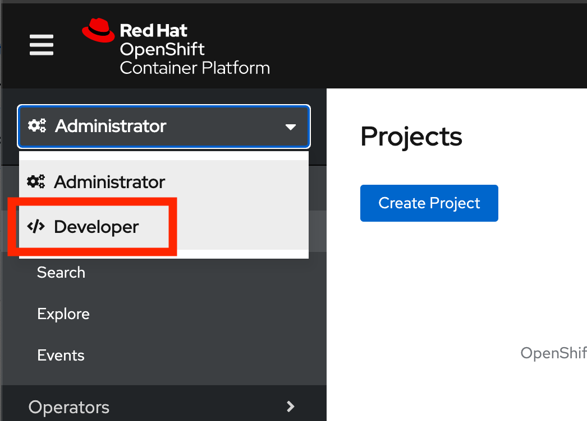
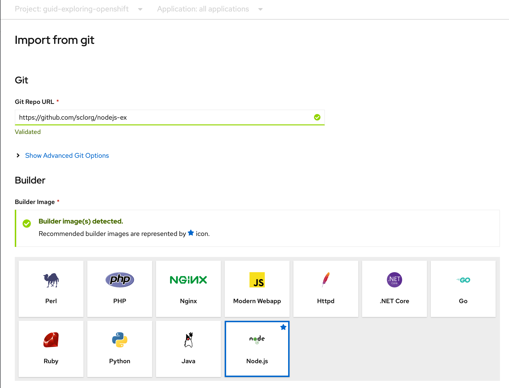
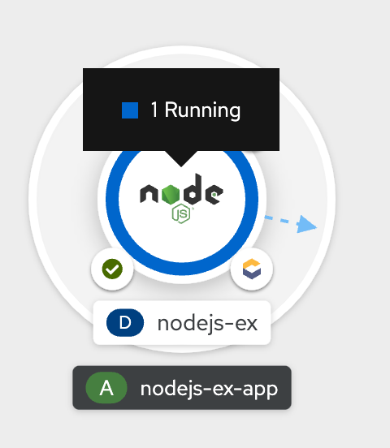

# 演習1. OpenShift ユーザエクスペリエンス 

## シナリオ

このラボでは、Red Hat OpenShift Container Platformでアプリケーションをデプロイするデモを行います。 

### 目標
* Web コンソールのパースペクティブ(DeveloperとAdministrator)を理解する。
* プロジェクトの作成
* Gitリポジトリからアプリケーションをビルドしてデプロイする
* ウェブコンソールのトポロジービューに慣れる
* アプリケーションのグループ化の一部としてリソースを関連付ける
* 配置されたリソースの管理者ビューを理解する

---
## Developer パースペクティブ

OpenShift Container PlatformのWebコンソールには、Administrator パースペクティブとDeveloperパースペクティブの2つのパースペクティブがあります。Developerパースペクティブでは、開発者のユースケースに特化したワークフローを提供します。

1. Developerパースペクティブに切り替えます。 アプリケーションを作成するためのオプションを持つTopologyビューが表示されます。


<div style="text-align: center;"></div>

---
## Project 作成

プロジェクトによって、あるユーザーのコミュニティが他のコミュニティから切り離された状態でコンテンツを整理・管理できます。プロジェクトはKubernetesネームスペースに対するOpenShiftの拡張で、ユーザーのセルフプロビジョニングを可能にする機能を追加したものです。 ほとんどの場合に互換性があります。

1. *Project* ドロップダウンメニューをクリックすると、利用可能なすべてのプロジェクトのリストが表示されます。 *Create Project* を選択します。


<div style="text-align: center;"></div>

> NOTE:
>
> 異なるプロジェクトはそれぞれに対応した異なるユーザー権限とクォータを持つことができます

2. *Name* を `test` として、プロジェクトを作成します。

---
## アプリケーションデプロイメント

Web コンソールの Developer パースペクティブでは、Add ビューからアプリケーションおよび関連サービスを作成できます。OpenShift Container Platform にデプロイするためにはいくつかのオプションがあります。

* 今回の手順では、Developerパースペクティブでアプリケーションを作成するための *Import from git* オプションを使います。 
* GitHubにある既存のコードベースを利用して、以下のようにOpenShift Container Platform上でアプリケーションを作成、構築、デプロイします。

### アプリケーションの作成
1. Add ビューで From Git をクリックし、Import from Git フォームを表示します。


<div style="text-align: center;"></div>


2. Git セクションで、アプリケーションの作成に使用するコードベースの Git リポジトリー URL を入力します。

```
https://github.com/sclorg/nodejs-ex.git
```


<div style="text-align: center;"></div>


3. ``を選択し、Builder セクションで、URL の検証後に、適切なビルダーイメージが検出され、自動的に選択されます（スターのマークが付きます）。
* ビルダーイメージが自動検出されていない場合は、ビルダーイメージを選択します。必要に応じて、Builder Image Version のドロップダウンリストを使用してバージョンを変更できます。

4. General セクションで、以下を実行します。
* *Application* フィールドに、アプリケーションを分類するために一意の名前 (nodejs-ex-app など) を入力します。アプリケーション名が namespace で一意であることを確認します。
* *Name* フィールドに、このアプリケーション用に作成されたリソースを分類するために一意な名前を入力します。これは Git リポジトリー URL をベースとして自動的に設定されます。


5. *Resources* セクションで、デフォルトのリソース *Deployment* を選択します 
* Deployment は単純な Kubernetesスタイルのアプリケーションを作成します。 
* "Deployment Config" は OpenShiftスタイルのアプリケーションを作成します。 
* "Knative Service" はマイクロサービスを作成します。

> NOTE:
>
> Knative Service オプションは、Serverless Operator がクラスターにインストールされている場合にのみ、Import from git 形式で表示されます。

6. Advanced Options セクションでは、Create a route to the application がデフォルトで選択されるため、公開されている URL を使用してアプリケーションにアクセスできます。
* アプリケーションをパブリックルートに公開したくない場合は、チェックボックスをクリアできます。

7. Create をクリックして、アプリケーションを作成し、Topology ビューでビルドのステータスを確認します。

---
## アプリケーションの作成 その２ （実施してみてください。）
### アプリケーションの作成
1. 以下の設定で、アプリケーションをデプロイしてみてください。
* GitHub レポジトリ URL：
```
https://github.com/RedHatGov/openshift-workshops.git
```

* *詳細の Git オプションの表示* → *コンテキストディレクトリー* を設定：
```
/dc-metro-map
```

2. デプロイして、*Route* からアプリケーションにアクセスしてみてください。


<div style="text-align: center;"></div>


---
## Topology ビュー

Web コンソールのDeveloperパースペクティブにあるTopologyビューでは、プロジェクト内のすべてのアプリケーション、そのビルドステータス、およびそれらに関連するコンポーネントとサービスを視覚的に表示します。


<div style="text-align: center;"></div>

1. グラフィカルな表示が表示されない場合は、Web コンソールの右上にある「Topologyビュー」アイコンをクリックします。


<div style="text-align: center;"></div>


2. Developer パースペクティブの左側のナビゲーションパネルを使用すると、Topology ビューに移動できます。
* アプリケーションを作成したら、Topology ビューに自動的に移動します。
* ここでは、アプリケーション Pod のステータスの確認、パブリック URL でのアプリケーションへの迅速なアクセス、ソースコードへのアクセスとその変更、最終ビルドのステータスの確認ができます。
* ズームインおよびズームアウトにより、特定のアプリケーションの詳細を表示することができます。


3. アプリケーションを作成し、イメージがデプロイされると、ステータスは Pending と表示されます。
* アプリケーションをビルドすると、Runningと表示されます。


<div style="text-align: center;"></div>

* 以下のように、異なるタイプのリソースオブジェクトのインジケーターと共に、アプリケーションリソース名が追加されます。
    * *D*: Deployment
    * *DC*: Deployment Configs
    * *SS*: StatefulSet
    * *DS*: Daemonset

> NOTE:
> 
> OpenShift Deployment Configsに加えて、Kubernetes _Deployments_ もサポートされています。

---
## Monitoring ビューの確認 (OpenShift Monitoring)

Red Hat は最近、モニタリング機能をウェブコンソールに統合しました。プロジェクト全体のメトリクスとイベントについてはこちらをご覧ください。

1. 左側のパネルで *Monitoring/確認* をクリックします。


<div style="text-align: center;"></div>

2. *Dashboard* タブをクリックする。
* Dashboardタブは、プロジェクトのメトリクスをまとめて表示します。

3. *Metrics* タブをクリックする。
* Metricsタブは、Prometheus Metricsのカスタムグラフを作成することができます。

4. *Events* タブをクリックする。
* Eventsタブは、報告されたイベントが一つのストリームとして表示され、フィルターできます。


---
## Pod の確認 (Readiness Probe / Liveness Probes)

Administrator パースペクティブから確認します。

1. 左側のメニューから、 *Workloads -> Pods* を選びます
* プロジェクトの *Pods* ページは、プロジェクトの中で現在実行中の全てのPodを表示します。
    * `Running`, `Pending` などコンテナの状態を確認することができます。
    *  *Ready*  列は Readiness チェックにもとづいたコンテナ内アプリケーションの状態が表示されます。

2. `openshift-workshops-git-XXXXX` Pod をリストから選びます。
* それぞれの *Pod* ページでは以下が表示されます。
    *  *メトリクス* タブ


<div style="text-align: center;">Memory Usage*, *CPU Usage*, *Filesystem* のグラフ</div>

* Podのステータスとそれをホストする OpenShift ノード
    * *Containers* セクションでは、イメージ名とコンテナの状態を含む情報が表示されます

3. `openshift-workshops-git` という名前のコンテナをクリックして *Container Details* ページを開く。
* アプリケーションコンテナの *Readiness Probe* と *Liveness Probes* を確認します。
* アプリケーションコンテナの *Resource Requests* と *Resource Limits* を確認します。

4. そのほか、各タブを見ていきます。
* *Logs* タブを選択します
    * Podのメッセージはここに表示され、更新されるにしたがって追跡することができます。
    * 更新によるログの出力を一時停止および再開することができます。

* *Terminal* タブを選択します
    * デバッグやテストのためにコンテナ内でコマンドを実行することができます。

* *Events* タブを選択します
    * このリストはPodのDeploymentで何かがおかしいかを探したり、イベントの連鎖を追跡したりするために使えます。

---
## OperatorHub から Operatorのインストール
Administrator パースペクティブから確認します。

### OpenShiftパイプラインのインストール

他のデモンストレーションを実施する前に、 OpenShift Container Platform の webコンソールのホームページへ行き、プロジェクトを削除しましょう。

1. OpenShiftパイプラインをインストール
* 管理者パースペクティブの下の左側のメニューから、Operators → OperatorHubに移動します。
* 検索ボックスでパイプラインを検索し、 OpenShiftPipelinesOperatorをクリックします。


<div style="text-align: center;"></div>

2. 説明ビューで、[インストール]をクリックして、すべてのインストール設定を確認します。


<div style="text-align: center;"></div>

3. Update Channelがstableに設定されていることを確認し、 InstallをクリックしてOperatorのインストールを開始します。


<div style="text-align: center;"></div>


4. 数秒後、インストールは正常に完了し、[ステータス]列で確認でき、ステータスが[成功]であるかどうかを確認できます。


<div style="text-align: center;"></div>

### OpenShift loggingのインストール
同様の手順でインストールしてみましょう。

### AMQ Streamsのインストール
同様の手順でインストールしてみましょう。

